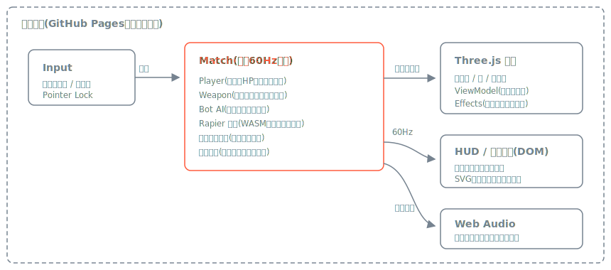

# FPS-reFlesh Play Style-

[](https://github.com/miruky/reflesh-fps-game-miruky/actions/workflows/ci.yml)
[](https://www.typescriptlang.org/)
[](https://threejs.org/)
[](https://vitest.dev/)
[](https://opensource.org/licenses/MIT)

**Three.js と Rapier で構築した、インストール不要でブラウザからそのまま遊べる 3D FPS です。** 3D モデル・画像・音声・フォントのアセットファイルを一切持たず、ジオメトリはプリミティブとプロシージャル GLSL の合成、効果音と BGM は Web Audio によるリアルタイム合成、UI は SVG と CSS のみで構成しています（コードネーム: hibana）。

**▶ 遊ぶ: https://miruky.github.io/reflesh-fps-game-miruky/**

## 概要

手作りの 20 ステージとシード生成される無限ステージを舞台に、フリーフォーオール・チームデスマッチ・ドミネーション・スコアアタックの対戦モードと、章立ての 48 ミッションのストーリーモードで BOT と戦う一人称シューターです。リコイルパターン、射撃ブルーム、ADS、タクティカル / 空リロード、部位ダメージ、距離減衰、壁貫通、4 種の投擲物、約 30 挺の武器と 12 種の光学サイトを組み合わせるクラス作成（Create-a-Class）といった FPS の中核メカニクスを、ゲームエンジンに頼らず TypeScript で実装しています。映画的なキルカメラ、ステージごとに変化する大気表現と BGM、実解像度を自動調整する動的 DPR による軽量化まで、アセットレスの制約下で AAA 級 FPS の体験を目指しています。

### なぜ作ったのか

リアルタイム 3D・物理シミュレーション・ゲーム AI・HUD 設計・オーディオ合成を 1 つの題材で横断するポートフォリオとして作成しました。FPS は「気持ちよく動いて当たり前」のジャンルであり、入力遅延、固定タイムステップ、レイキャスト判定、反動制御、照準とサイトの一致といった低レイヤーの品質がそのまま体験に出ます。エンジンを使わずに組むことで、その全てを自分の責任範囲に置いています。

### 開発状況

コア戦闘ループ（移動・射撃・BOT 戦）、戦闘拡張（投擲物・武器アタッチメント・約 30 挺の武器・スライディング / マントリング / リーン・壁貫通・部位ダメージ）、モード拡張（4 対戦モード + ストーリー・BOT 同士の交戦・拠点制圧・観戦カメラ）、メタゲーム（XP・アンロック・任務・レート・通算戦績）、素手格闘モード（空中降下衝撃波）、戦車ボス / ドローン / 固定砲台の敵種、映画的キルカメラ、全ステージのアトモスフィアとステージ別 BGM、AAA 級のフルスクリーン UI（IGNITION FRAME デザインシステム）、ゲームパッド対応、色覚サポートなどのアクセシビリティ設定を実装済みです。対人マルチプレイヤーは未実装で、段階的に追加します。全要求機能の一覧は [docs/REQUIREMENTS.md](docs/REQUIREMENTS.md) に記録しています。

## 操作

キーボード / マウスに加えて、PS4 / BO3 系のレイアウトに対応したゲームパッドでも操作できます。

| 操作                 | キー                                 |
| :------------------- | :----------------------------------- |
| 移動                 | W A S D                              |
| 視点                 | マウス                               |
| 射撃                 | 左クリック                           |
| ADS(覗き込み)        | 右クリック(トグル設定あり)           |
| ジャンプ / よじ登り  | Space(空中で前進入力中に壁へ)        |
| スラスト二段ジャンプ | 空中で Space(着地・壁取り付きで回復) |
| しゃがみ             | C / 左 Ctrl                          |
| スプリント           | 左 Shift                             |
| スライディング       | スプリント中に C                     |
| スライドジャンプ     | スライド中に Space(運動量を保持)     |
| ウォールラン         | 壁沿いを空中で前進(自動)             |
| ウォールジャンプ     | ウォールラン中に Space               |
| 空中降下攻撃(素手)   | 空中で射撃/近接(衝撃波で着地)        |
| リーン               | Q / E                                |
| リロード             | R                                    |
| 武器切替             | 1 / 2 / ホイール                     |
| グレネード           | G(長押しで構え、離して投擲)          |
| 投擲物切替           | 3                                    |
| 近接攻撃             | V                                    |
| アルティメット       | F(ゲージ満タンで発動)                |
| 息止め(スコープ)     | Shift(覗き込み中に揺れを止める)      |
| スコアボード         | Tab                                  |
| ポーズ               | Esc                                  |

## アーキテクチャ



物理とゲームロジックは固定 60Hz で更新し、描画と視点操作はディスプレイのリフレッシュレートに追従させています。HUD は DOM で構築し、毎フレームのスナップショット（イミュータブルな状態の写し）だけを受け取るため、ゲームロジックから UI への参照は一方向です。描画は Three.js の EffectComposer 上でブルーム・AgX トーンマップ・カラーグレード・被弾演出を合成し、負荷に応じて実解像度を自動で上下させる動的 DPR で 60fps を維持します。

## 技術スタック

| カテゴリ | 技術                     |
| :------- | :----------------------- |
| 言語     | TypeScript 5(strict)     |
| 描画     | Three.js r170(WebGL)     |
| 物理     | Rapier(Rust 製 / WASM)   |
| 音       | Web Audio(リアルタイム合成) |
| ビルド   | Vite                     |
| テスト   | Vitest(410 テスト)       |
| リンタ   | ESLint + Prettier        |
| CI / CD  | GitHub Actions           |
| 配信     | GitHub Pages             |

## 実装済みの機能

### 移動と射撃

移動系は WASD・スプリント・しゃがみ・ジャンプに加え、スライディング、壁へのよじ登り（マントリング）、ウォールラン / ウォールジャンプ、スラスト二段ジャンプ、Q / E でのリーン、コヨーテタイム、ジャンプ入力バッファ、落下ダメージ、移動状態に連動する足音まで実装しています。射撃系はヒットスキャン、武器ごとのリコイルパターン、連射で増えるブルーム、ADS による精度・速度・FOV の変化、タクティカル / 空リロードの使い分け、武器切替、近接攻撃を備え、ADS 時は各武器のアイアンサイト / 光学が画面中央（＝弾着点）へ一致します。武器を持たない素手格闘モードでは、空中でボタンを押すと降下して衝撃波で着地する専用アクションを行えます。

### 兵装（Create-a-Class）

メイン武器は AR・SMG・DMR・スナイパー・ショットガン・バーストライフル・LMG・マークスマンなど約 30 挺で、サイト・マズル・グリップ・マガジンの 4 スロットにアタッチメントを組み合わせられます。光学サイトはリフレックス・ホログラフィック・ACOG・可変倍率・サーマル・ハイブリッドなど 12 種を用意し、覗くとレンズ越しに背後が透けて見える正しい描画と、種類ごとに識別できるレティクルを持ちます。兵装画面は 3D の武器プレビューとステータスバー・派生スタット（DPS / 確殺弾数 / TTK）を備えた BO3 系のクラス作成 UI です。

### 敵とゲームモード

BOT は視野と遮蔽・煙幕を考慮した索敵、発砲音への警戒反応（サプレッサーで抑制可）、フラッシュによる失明、交戦距離を保つストレイフ移動を行い、3 段階の腕前を選べます。敵種は人型に加えてドローン・戦車ボス・固定砲台があり、精鋭 / ボスの強化個体も登場します。投擲物はフラグ・スモーク・フラッシュ・焼夷の 4 種で、投擲前に弾道プレビューが表示されます。ゲームモードは個人キルを競うフリーフォーオール、チームデスマッチ、3 拠点を奪い合うドミネーション、時間内の最終キル数を競うスコアアタックの 4 種と、章立ての 48 ミッションで進むストーリーモードです。

### 演出・オーディオ・映像

BOT に倒された直後は相手の視点から自分の倒れた地点を映す映画的キルカメラに切り替わり、どこから撃たれたのかを把握できます。ステージは時間帯やテーマに応じた大気表現（草・環境パーティクル・接地霧・ムード別カラーグレード）を持ち、BGM もステージのムードごとに切り替わる軍事エレクトロニカ調です。効果音はプロシージャルなリバーブ、多層構成の銃声、距離減衰と遮蔽、環境音までを Web Audio で合成します。全画面 UI は BO2 / BO3 の計器表現と MW2019 の余白設計を混ぜた IGNITION FRAME デザインシステムで統一しています。

### メタゲームとアクセシビリティ

試合結果はプレイヤープロフィールに積み上がります。勝敗・キル・ヘッドショット・拠点制圧などから XP を獲得してレベルが上がり、武器・アタッチメント・光学はレベル到達で順次解放されます。任務（チャレンジ）の達成で追加 XP を得て、完走した試合はレートを変動させて階級に反映します。通算戦績はメイン画面に常時表示され、記録は localStorage に保存するほか JSON ファイルとして書き出し・読み込みができます。アクセシビリティ設定として、敵味方の配色変更（色覚サポート）、画面揺れ軽減、HUD サイズ、ADS / しゃがみのホールド / トグル切替、Y 軸反転、UI アクセント色、試合時間、画質ティアなどを設定画面から調整できます。設定値は範囲外や壊れた値を読み込み時に既定へ補正します。

## プロジェクト構成

- `src/core` — 入力（ゲームパッド含む）、ゲームループ、シード付き乱数、音・BGM 合成、設定とプロフィールの永続化
- `src/game` — 弾道計算、武器、光学（optics）、アタッチメント、投擲物、モードルール、弾倉、反動、プレイヤー、BOT、ステージ生成、バイオーム、キャンペーン、進行度、メダル、チーム配色、試合進行
- `src/render` — エフェクト、一人称ビューモデル、アトモスフィア、カラーグレード、ポスト処理、兵装プレビュー
- `src/ui` — HUD、メニュー画面、メニュー背景（宇宙）
- `docs` — 要件定義書、アーキテクチャ図
- `.github/workflows` — CI と GitHub Pages デプロイ

## はじめ方

### 前提条件

- Node.js 20 以上（CI は Node 22 を使用）

### セットアップ

```bash
git clone https://github.com/miruky/reflesh-fps-game-miruky.git
cd reflesh-fps-game-miruky
npm install
npm run dev
```

### テストの実行

```bash
npm test
```

### Lint の実行

```bash
npm run lint
```

### デプロイ

`main` ブランチへのプッシュで GitHub Actions がビルドし、GitHub Pages へ自動デプロイします。手元での本番ビルドは `npm run build` で `dist/` に出力されます。

## 設計方針

- **アセットレス** — モデルはプリミティブとプロシージャル GLSL、効果音と BGM は Web Audio で合成、UI は SVG / CSS のみ。リポジトリにバイナリを置かない
- **決定論的ステージ生成** — シード付き PRNG(mulberry32)でステージを生成し、同一性をテストで保証
- **固定タイムステップ** — 物理・ロジックは 60Hz 固定、視点操作と描画はリフレッシュレート追従で入力遅延を最小化
- **純粋ロジックの分離** — 弾道・反動・弾倉・ステージ生成・光学は DOM / GPU 非依存のモジュールとして切り出し、Vitest で検証
- **データ駆動の武器バランス** — 武器と光学の挙動は定義データの数値に集約し、調整がコード変更なしで完結
- **軽量維持** — 半解像ブルーム・動的 DPR・ティア別予算で、演出を盛りつつフレームコストを抑える

## ライセンス

[MIT](LICENSE)
